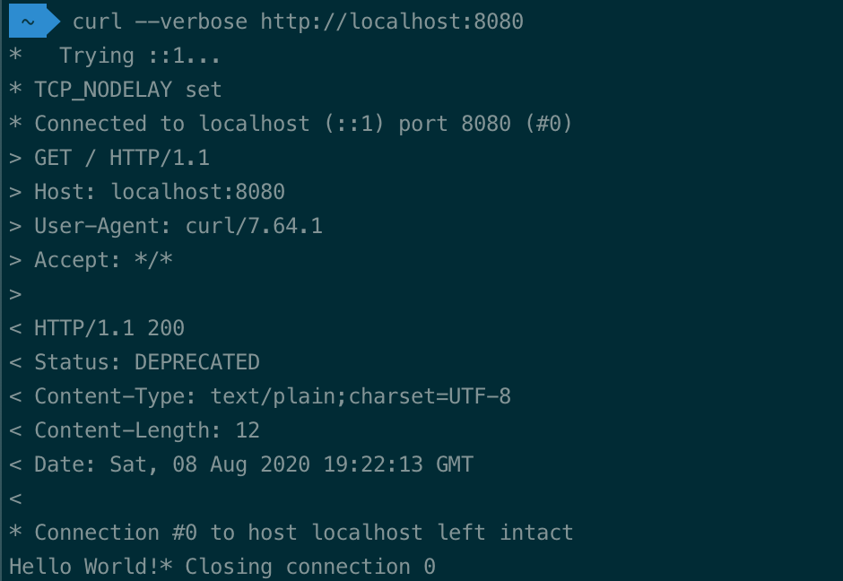

# Spring Boot Status Header
[](https://github.com/cgrotz/spring-boot-status-header/blob/master/LICENSE)
[](https://github.com/cgrotz/spring-boot-status-header/actions?query=workflow%3A%22Java+CI+with+Maven%22)
[](https://www.codefactor.io/repository/github/cgrotz/spring-boot-status-header)

# What is this project about
Were you ever in the situation that you needed to inform consumers of your APIs that certain endpoints are going to be deprecated soon?

And you didn't just want to send e-mails to everybody, or post it on a support forum, but wanted to give them a fast and easy way how they can monitor for deprecated API usage in their application?

You need to look no further *spring-boot-status-header* is what you didn't know you want, but needed the whole time. It allows you to annotate your request handlers and controllers with status hints like deprecated, alpha and beta. The hint will be conveniently put in the `Status` header of the HTTP response. 

But wait, there is more! You want to pass additional information along? Even that is possible by adding life saving information like: "Deprecated, Removeal on January first". You need to look no further *spring-boot-status-header* is exactly what you are looking for.



# Getting Started
Before you can get started you will need to include the dependencies in your project:

## Usage with WebMVC
Simply include spring-boot-status-header-webmvc-starter as a dependency in your maven pom:
```xml
<dependencies>
    <dependency>
        <groupId>de.cgrotz</groupId>
        <artifactId>spring-boot-status-webmvc-starter</artifact>
        <version>1.0.0</version>
    </dependency>
</dependencies>
```

## Usage with WebFlux
Simply include spring-boot-status-header-webflux-starter as a dependency in your maven pom:
```xml
<dependencies>
    <dependency>
        <groupId>de.cgrotz</groupId>
        <artifactId>spring-boot-status-webflux-starter</artifact>
        <version>1.0.0</version>
    </dependency>
</dependencies>
```

## Method Level Annotations
When you have successfully configured your Spring Boot project, you can annotate your methods with either the @Status or @Deprecated annotation.

```java
@RestController
public class YourRestController {
    @GetMapping("/deprecated")
    @Deprecated
    public String deprecatedMethod() {
        return "Hello World!";
    }
}
```

or

```java
@RestController
public class YourRestController {

    @GetMapping("/beta")
    @Status(StatusValue.BETA)
    public String betaFunctionality() {
        return "Hello World!";
    }
}
```

## Class Level Annotations
You can also annotate whole classes with either annotation.
```java
@Deprecated
@RestController
public class YourRestController {
    ...
}
```

or

```java
@Status(StatusValue.BETA)
@RestController
public class YourRestController {
    ...
}
```

## Example Client Usage
For example your consumers can check for the status header in a RestTemplate Interceptor.
```java
public class StatusInterceptor implements ClientHttpRequestInterceptor {
 
  @Override
  public ClientHttpResponse intercept(
    HttpRequest request, 
    byte[] body, 
    ClientHttpRequestExecution execution) throws IOException {
 
     ClientHttpResponse response = execution.execute(request, body);
     if(response.getHeaders().containsKey("Status")) {
        log.warn("Endpoint {} {} reported status {} with info {}", 
          request.getMethod(),request.getURI(), 
          response.getHeaders().get("Status"), 
          response.getHeaders().get("Status-Info") );
     }
    return response;
  }
}
```

You can then use the interceptor in a RestTemplate like this:
```java
RestTemplate restTemplate = new RestTemplate();
restTemplate.getInterceptors().add(new StatusInterceptor());
```
